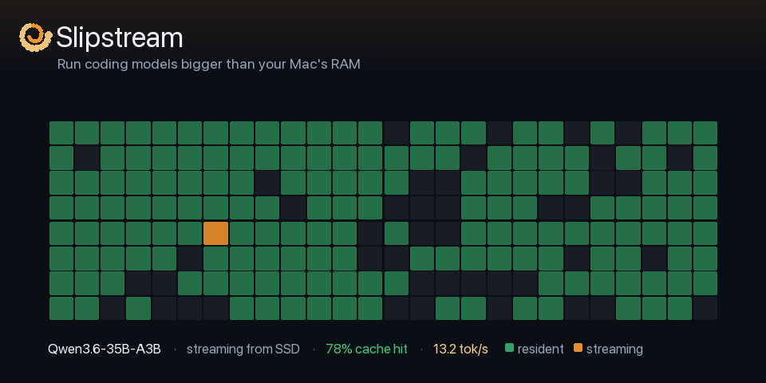

<p align="center">
  
</p>

# Slipstream



**Run coding models that are bigger than your Mac's RAM — locally, privately, at usable speed.**

Slipstream is a fork of [llama.cpp](https://github.com/ggml-org/llama.cpp) that **streams Mixture-of-Experts (MoE) expert weights from your SSD** instead of forcing the whole model into memory. A 16–36 GB Apple-Silicon Mac can run 35B–480B MoE coding models while the machine stays usable — no cloud, no API keys, no data leaving your laptop.

It ships as a native macOS app with the **engine bundled inside** — download the `.dmg`, drag it to Applications, open it. Nothing to compile, no dependencies to install. Point your AI coding assistant (Kilo Code / Cline / Cursor / OpenCode / anything OpenAI-compatible) at `http://127.0.0.1:8080/v1`, and go.

> Not affiliated with Ollama. Slipstream is a llama.cpp/Metal fork with a custom SSD expert-streaming layer (PGRN) and a self-contained control app.

---

## Why this exists

MoE models are huge on disk but only activate a few "experts" per token. A 118B model with 8B active parameters means most of the weights sit idle at any moment. Slipstream keeps the always-needed weights resident and **streams the routed experts from SSD on demand**, with a bounded, RAM-sized cache (a per-layer CLOCK-LRU-K arena) that keeps your Mac responsive — it refuses loads that would starve the system rather than swapping you to death.

The result: models that simply won't fit in your RAM become runnable.

---

## Get started (60 seconds)

1. **Download** the latest `Slipstream_x.y.z_aarch64.dmg` from [Releases](../../releases).
2. **Drag** `Slipstream.app` into **Applications**. *(First launch: right-click → Open, once — the app is not yet notarized.)*
3. **Open it.** Slipstream auto-detects your Mac and shows the **best settings for your machine** — cache size, context, and I/O threads are derived from your RAM and CPU cores. Click **Apply best**.
4. **Pick a model** from the dropdown → **Download** (with progress). Generate its PGRN sidecar (see *Models* below).
5. Click **Start**. When the pill turns green, you're serving an OpenAI-compatible API on `127.0.0.1:8080`.
6. In your coding assistant, add an **OpenAI Compatible** provider — or hit **one-click patch** for Kilo/OpenCode and just restart VS Code.

Everything runs on-device. The app shows live SSD throughput, cache hit-rate, tokens/sec, token usage, and RAM headroom while you work. UI in **English, German, Chinese, Spanish**.

---

## Measured results

Real numbers on a 36 GB Apple-Silicon Mac, recorded in [`bench/RESULTS.md`](bench/RESULTS.md). This is an evidence-first project — we publish the honest numbers, including the negative ones. Full write-up: [`BENCHMARKS.md`](BENCHMARKS.md).

### Qwen3.6-35B-A3B (Q4), streamed from the internal NVMe

| Cache | Decode | Cache hit-rate |
|------:|-------:|---------------:|
| 2 GiB | ~5.5 tok/s | ~21% |
| 10 GiB | ~13 tok/s | ~78% |
| 14 GiB | ~19 tok/s | ~86% |

Prefill of a large (~30k-token) coding-agent prompt: **75 → 208 tok/s (2.7×)** with `ubatch 2048` + parallel I/O threads.

### Laguna S 2.1 (118B-A8B, Q4) — a model that does *not* fit in 36 GB

| Configuration | Decode | vs. baseline |
|---|---:|---:|
| PGRN on external USB SSD, no draft | 0.72 tok/s | 1.0× |
| **PGRN on internal NVMe** (storage split) | 1.95 tok/s | **2.7×** |
| + DFlash speculative draft | 2.36 tok/s | 3.3× |
| + larger cache | **2.83 tok/s** | **3.9×** |

**Key finding:** the streamed file (PGRN) belongs on your *fastest* disk; the model file (GGUF) is read once at load and can live anywhere. This "storage split" was the single biggest lever — 2.7× on its own.

---

## Compatible models

Slipstream streams **experts**, so it needs a **MoE** architecture with **Q4_K / Q5_K / Q6_K** expert tensors that mainline llama.cpp understands. Not: dense models (no experts to stream), or IQ/Q2/Q3/Q8_0/MXFP4 expert quants.

**Interactive tier** (small active params — the daily drivers):

| Model | Total / Active | Note |
|---|---|---|
| Qwen3.6-35B-A3B | 35B / 3B | recommended, MTP speed |
| Qwen3-30B-A3B | 30B / 3B | no MTP, lighter |
| DeepSeek-V2-Lite | 16B / 2.4B | smallest, lowest RAM |
| GLM-4.5-Air | 106B / 12B | strong quality |
| Laguna S 2.1 | 118B / 8B | DFlash speculative decoding |

**XL streaming tier** (verified against mainline llama.cpp; 240–466 GB Q4 — needs a big fast SSD):

| Model | Total / Active | Note |
|---|---|---|
| Qwen3-Coder-480B | 480B / 35B | coding-focused |
| Llama 4 Maverick | 400B / 17B | fastest decode of the giants |
| DeepSeek V3 | 671B / 37B | general |
| DeepSeek R1 | 671B / 37B | reasoning (thinking tokens slow agent use) |
| GLM-5.2 | 744B / 40B | top-tier; large — big SSD or lower quant |

*Coming once merged into mainline llama.cpp:* MiniMax M3 (23B active), DeepSeek V4-Flash (13B active).

The app's dropdown is seeded with these; you can point it at any compatible GGUF. **Model weights are not included** — you download them from Hugging Face. Slipstream is the engine and the tooling.

---

## How it works

- **PGRN sidecar** — a converter extracts the stacked expert tensors into a streamable binary next to the GGUF. Reads use `pread` + `F_NOCACHE` so the OS page cache never balloons and fights the RAM budget.
- **Layer-partitioned arena** — one bounded CLOCK-LRU-K cache tier per layer; cross-layer eviction is impossible by design, so streaming stays predictable.
- **Memory-health gate** — admission refuses a cache that would push the Mac into swap; "the Mac stays usable" is a hard invariant.
- **Speculative decoding** — MTP (Qwen) or DFlash (Laguna) drafts multiple tokens per target pass.
- **Async prefetch (opt-in, experimental)** — a background thread warms the next layer's experts while the current layer computes, driven by a predictor table (`PGCT1`) or expert-coupling table (`PGCC1`). The async machinery is wired end-to-end; making the *prediction* reliably beat the SSD-fetch wall is ongoing research (see `bench/`).
- **Parity gate** — a test asserts streamed output is bit-identical to fully-resident output (NMSE = 0). Optimizations that only reorder eviction are parity-neutral by construction.

Architecture notes: [`docs/ARCH.md`](docs/ARCH.md).

---

## Honest limitations

- **Speed scales with your SSD and RAM.** More resident cache = higher hit-rate = faster. External USB SSDs are a real bottleneck (put the streamed PGRN on internal NVMe). Decode is ~78–92% SSD-fetch-bound.
- **Big agentic prompts are prefill-heavy.** A 30k-token first request on a streamed model takes minutes; enable codebase indexing so your assistant sends small, relevant prompts. Subsequent turns reuse the KV cache and are fast.
- **118B on 36 GB is "usable for batch," not "snappy for chat."** ~2.8 tok/s. The 35B is the interactive workhorse (~14 tok/s).
- **The GGUF→PGRN converter currently needs the Python tooling** in this repo (`bench/`); bundling it into the app is on the roadmap. The engine itself is fully bundled.
- **The app is not yet notarized** — first launch needs a one-time right-click → Open (or `xattr -dr com.apple.quarantine Slipstream.app`).

We'd rather tell you the ceiling than oversell a 5× miracle.

---

## Repository layout

```
engine/    our new source files (PGRN streaming, prefetch, admission, arena, …) — path-preserving, browsable
patches/   slipstream-seams.patch — our changes to upstream llama.cpp files
apply.sh   clones ggml-org/llama.cpp @ pinned commit, drops in engine/, applies the patch
app/       the Tauri 2 control app (dist/ frontend + src-tauri/ Rust backend)
bench/     benchmark methodology + recorded results (RESULTS.md)
docs/      architecture notes
```

## Building from source

Requires Xcode command-line tools, CMake, and Rust + the Tauri CLI.

```bash
# 1. Reconstruct the engine (upstream llama.cpp @ pin + our changes)
./apply.sh                    # -> ./llama.cpp-slipstream

# 2. Build a self-contained, Metal-embedded server binary (no external deps)
cd llama.cpp-slipstream
cmake -B build-static -DCMAKE_BUILD_TYPE=Release -DBUILD_SHARED_LIBS=OFF \
      -DLLAMA_OPENSSL=OFF -DLLAMA_CURL=OFF -DGGML_METAL_EMBED_LIBRARY=ON \
      -DCMAKE_OSX_ARCHITECTURES=arm64
cmake --build build-static --target llama-server -j
cd ..

# 3. Bundle it into the app and build the .dmg
cp llama.cpp-slipstream/build-static/bin/llama-server app/src-tauri/resources/llama-server
cd app/src-tauri && cargo tauri build   # -> the self-contained .dmg
```

`otool -L build-static/bin/llama-server` should list **only** system frameworks — no `@rpath`, no Homebrew, no OpenSSL. That's what makes the app copy-and-run on any Apple-Silicon Mac.

---

## Acknowledgements

Slipstream was **inspired by [Colibrì](https://github.com/JustVugg/colibri)** by JustVugg — the project that showed a 700B-scale MoE model streaming from disk on consumer hardware. Colibrì is pure-C on CPU/CUDA; Slipstream adapts the idea for **Apple Silicon** (Metal + unified memory) with a native app and its own PGRN engine. Several reference ideas — the disk-benchmarking methodology, route-trace / expert-coupling analysis, and RAM admission — came from studying Colibrì. Thank you. 🐦

---

## License & attribution

The **Slipstream additions** — the PGRN expert-streaming layer (`engine/`), the seams patch, and the control app (`app/`) — are released under the **MIT License** (see [`LICENSE`](LICENSE)).

Slipstream is built on **llama.cpp** (MIT, © the ggml authors). The upstream sources are **not** vendored here; `apply.sh` fetches them from the pinned commit and retains their original license. Model weights are the property of their respective creators and are not distributed here.

---

*Slipstream is an evidence-first project: expected performance figures are hypotheses until recorded in `bench/RESULTS.md`.*
